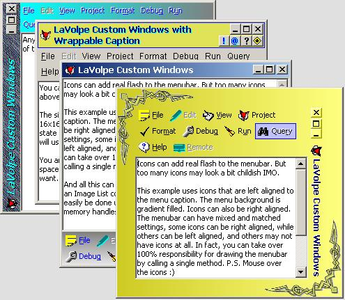



## LaVolpe Custom Windows II \(Updated w/Help File\)

### Description

Many have asked for it &amp; you'll see why this took so long to update/repost. Version 2 now allows 100% customization of the standard rectangle window. Over 100 properties/methods to choose from. And if you don't like the wide range of available options, the project is built to route drawing requests to your callbacks. This project is almost 7,000 lines of code &amp; half again that much in comments. It has been tested well on 2K &amp; 98, but project is so large I may not have caught potential bugs in all possible scenarios of options and settings. Kinda hoping you all will help there. Please let me know of any bugs found. Wow, this one was tough !!! Oh yeah, almost forgot. The project is a group, unzip using the option to Use Folders &amp; open the .vbg file. Last Update: 12 Oct/20:25est. Fixed bug in NT4 where menus were not being read. Compiled hlp file now included. 25 Nov/17:10est. Fixed bug related to ActiveX controls; tooltips didn't display when compiled; minor patches &amp; updated help file to include the help contents portion too. See iCoreMessages for complete update history.
 
### More Info
 

             |
---                |---
**Submitted On**   |2005-11-24 15:21:52
**By**             |[LaVolpe](https://github.com/Planet-Source-Code/PSCIndex/blob/master/ByAuthor/lavolpe.md)
**Level**          |Advanced
**User Rating**    |5.0 (330 globes from 66 users)
**Compatibility**  |VB 6\.0
**Category**       |[Graphics](https://github.com/Planet-Source-Code/PSCIndex/blob/master/ByCategory/graphics__1-46.md)
**World**          |[Visual Basic](https://github.com/Planet-Source-Code/PSCIndex/blob/master/ByWorld/visual-basic.md)
**Archive File**   |[LaVolpe\_Cu19510411252005\.zip](https://github.com/Planet-Source-Code/lavolpe-lavolpe-custom-windows-ii-updated-w-help-file__1-62605/archive/master.zip)

### API Declarations

Tons

